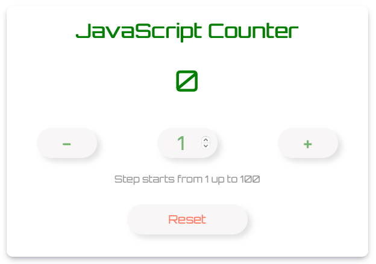

<h1 align="center">JavaScript Counter</h1>

 
Javascript Basics project for Start2Impact: a simple counter with fancy features

## About the counter

This project is the final practice project for Start2Impact Javascript Basic course.
It's a simple counter with some useful features and a nice look

## Features

The counter provides the following features:

- Two buttons to add or subtract a value to and from the counter
- An input field to set the required step value to add or subtract
- A reset button to restart the counter
- A validation system that checks the step value and force to a number from 1 up to 100

## Languages

- HTML5
- CSS3
- Javascript ES6

## System requirements

A common recent browser

## Installation

Just download all files and folder and run locally in your favorite browser opening the index.html file

## Take a look and try it

You can try the counter following this link: [JavaScript Counter](https://alchemy-lab.github.io/javascript-counter/)

## Contact Me

Any questions or features request? Fill the form at the [Studio Alchemy website](https://alchemy-lab.github.io/#contact)
